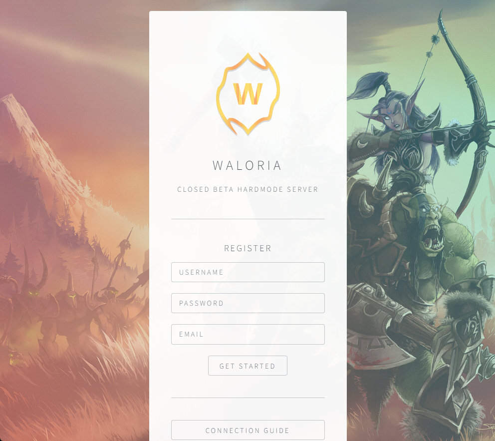
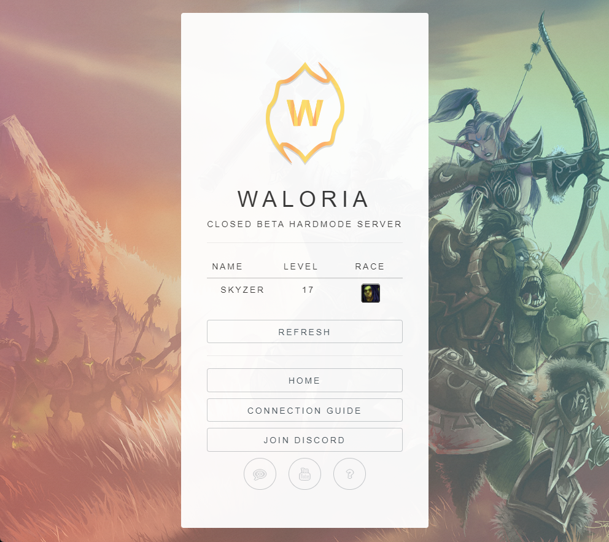
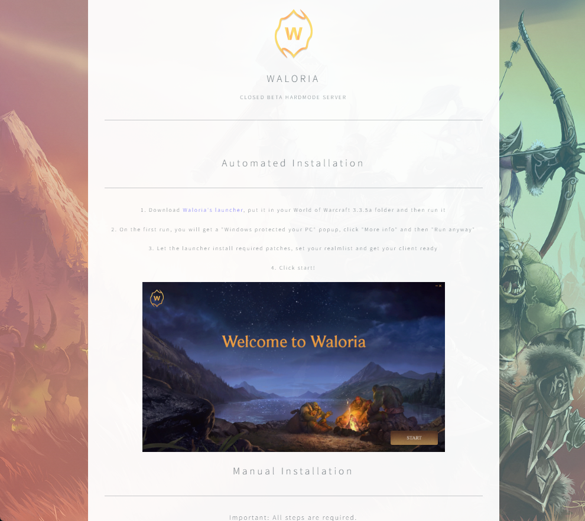

# Overview

This document highlights extensive 3.3.5a client and server-side additions and modifications I have implemented that changes core aspects of the game. This was done by extending upon and modifying the open-source project [AzerothCore](https://github.com/azerothcore/azerothcore-wotlk/) as well as implementing standalone tools, applications and workflows required for collaborative work. 

**Languages used**: C++, Python (SqlAlchemy, Flask), Lua (AIO), SQL (MySql), TypeScript (Angular/Electron), PHP and more.

Below, you can find descriptions of the different systems, how they work and some visual previews highlighting the final results.

- [Overview](#overview)
  - [Launcher \& Website](#launcher--website)
  - [Procedural Items \& Profession Recipes](#procedural-items--profession-recipes)
    - [Single item generation interface](#single-item-generation-interface)
    - [Mass generation interface](#mass-generation-interface)
      - [Item archetypes](#item-archetypes)

## Launcher & Website

  

**Languages used**: PHP, JavaScript (TypeScript), Node.JS (Express, Angular, Electron) 

The website is quite minimalistic but it allows players to register an account, see who is online and download the launcher which is required to play. 

The launcher verifies the local installation, cleans client-side cached data, fetches new client-side data (MPQ files), sets the realmlist, downloads required AddOns (AIO) and Waloria's custom executable (Waloria.exe). 

It is communicating to a back-end written in JavaScript using Node.JS and Express. The back-end runs in parallel with the webserver and on intervals scans the web folder containing all download materials to automatically be distributed to people running the launcher. This results in that pushing a change to all players is as easy as moving a file to another folder through e.g., FTP/SFTP.

Once the launcher has done the required client-side changes, the player can press start and the custom experience is ready to be enjoyed.


https://github.com/fredriksa/Waloria/assets/4513815/f10674c3-31fb-429b-941e-2f72c1dac054


<video src="https://github.com/fredriksa/Waloria/blob/main/assets/launcher.mp4" controls="controls" style="max-width: 730px"></video> 
<video src="./assets/loginscreen.mp4" controls="controls" style="max-width: 730px;"></video>

## Procedural Items & Profession Recipes

**Languages used**: C++, Python, SQL (MySQL)

I developed a procedural item generation tool that predictvely models items like they would be modelled by Blizzard Entertainment based on the item data that exists in the game today. There are a lot of factors to take in account, and a lot of values to model, so this has been a major piece of work. In the end, this allowed me to distribute hundred of thousands of procedurally generated items into the game world that seemingly blend in well-enough with the base game while giving the players some excitement for not knowing what can be found next.

Annother benefit of this is that items do not end up being "subjectively" hand-crafted by people who try with their best ability estimate how the new items they are creating stands in terms of power relative to all the other items that currently exist, and remove the situation where developers might be biased towards making their quest or dungeon reward the best piece of equipment. Also, re-balancing of items and their powers can relatively easily be done on a "global" scale without having to manually alter all the items one-by-one.

To implement this sytem, I had to spend a lot of effort on answering the following:

1. How can I develop a system that allows describing item archetypes in a large-scale MMORPG? What data is needed to ensure that the item generated from an archetype is holding up to that type? 
2. How can I maintain such a large quantity of items and apply changes to the underlying procedural generator without drastically changing players' obtained items, having to remove them or avoid deviating too far from what makes an item feel like a specific item?
3. How can I describe many item archetypes while having each archetype be modelled in a general way while being balanced?
4. How can other developers interface with this generator?
5. How should I distribute large quantities of items in a even larger world?

### Single item generation interface

### Mass generation interface

To generate large quantities of items, I had to come up with an interface that could be used to describe what items should be generated. Here, it is possible to define what an item archetype is, how many items should be generated, what tier they are and so on. Below, are some snippets from the data actually used to generate all the items.

The top-level interface requires the developer to input a path to the output directory, whether the item is a profession item or not, and what tiers of items with qualities that should be generated. The rest, the generator internally takes care of.

```py
  outputFile = "output/mass_generate_output.sql"
  metaData = "general_items"
  tiersAndQualities = {
      "T1": ["Uncommon"],
      "T2": ["Uncommon", "Rare", "Epic"],
      "T3": ["Rare", "Epic"],
  }
  generateTierToQuality(tiersAndQualities)
```

The generator is capable of generating ~250 items a second with one thread. This includes all the item data, item recipe data and item meta data. The additional data let's other systems build ontop and easily make use of the procedurally generated items.

#### Item archetypes

In total, more than 15 item archetypes were defined. An item archetype is a general description of all the items belonging to that archetype. For instance, mail healing gear is an archetype that consists of stats such as stamina and intellect but sometimes spellpower or other stats. In the archetype description, we can allocate how much of an items total power goes into the stats, the generator will normalize the allocation so that it does not go above a certain threshhold to keep items procedurally generated. This means that even if we have a combined reserved allocation of 100% the items power, at most e.g., 60% of the items power will be reserved. 

```py
"MailHealer": { 
    "subclass": "Mail", 
    "stat1": {"name": "Stamina", "baseDistribution": 0.2},
    "stat2": {"name": "Intellect", "baseDistribution": 0.35},
    "rstat1": {"name": "Spellpower", "baseDistribution": 0.1},
    "rstat2": {"name": "Crit", "baseDistribution": 0.07},
    "rstat3": {"name": "Haste", "baseDistribution": 0.07},
    "rstat4": {"name": "Mana Per 5", "baseDistribution": 0.07}
}
```

The second part of defining an archetype is defining what type of equipment should be generated using these stats and this distribution. Another interface was implemented for this to let the developer easily specify what equipment should be generated. This is needed as in World of Wacraft, some classes use certain types of equipment. The list below describes the base equipment types that will be part of every item archetype.

```py
BASE_ITEM_SLOTS = [
    ["Chest"],
    ["Waist"],
    ["Legs"],
    ["Feet"],
    ["Wrist"],
    ["Hands"],
    ["Shoulder", None, 18],
    ["Head", None, 20],
    ["Back", "Cloth"],
    ["Neck", "Neck", 15],
    ["Finger", "Finger", 11],
    ["Trinket", "Trinket", 30]
]
```

Then, developers can extend upon this to be more specific with item types for a specific archetype.

```py
ITEM_SLOTS_PER_ITEM_SET["MailHealer"].append(["Shield", "Shield"])
ITEM_SLOTS_PER_ITEM_SET["MailHealer"].append(["Off-Hand(Tome)", "Off-Hand(Tome)"])
```

Another interface is used to specify which weapon types and which slots should be generated for that item archetype.

```py
"PlateTank": [
    ["One-Hand", ["Axe", "Mace", "Sword", "Fist Weapon"]],
    ["Bow", ["Bow"]],
    ["Gun", ["Gun"]],
    ["Thrown", ["Thrown"]],
    ["Main-Hand", ["Axe", "Sword", "Mace"]],
    ["Crossbow", ["Crossbow"]],
]
```

