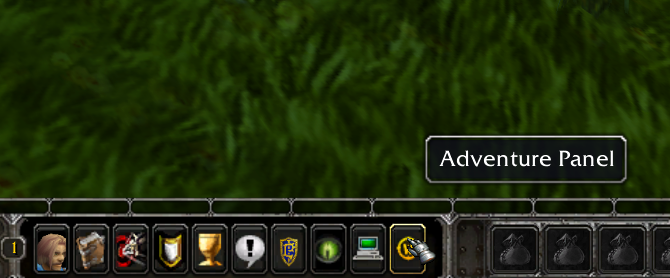

# Overview

This document highlights extensive 3.3.5a client and server-side additions and modifications I have implemented that changes core aspects of the game. This was done by extending upon and modifying the open-source project [AzerothCore](https://github.com/azerothcore/azerothcore-wotlk/) as well as implementing standalone tools, applications and workflows required for collaborative work. 

**Languages used**: C++, Python (SqlAlchemy, Flask), Lua (AIO), SQL (MySql), TypeScript (Angular/Electron), PHP and more.

Below, you can find descriptions of the different systems, how they work and some visual previews highlighting the final results.

- [Overview](#overview)
  - [Launcher \& Website](#launcher--website)
  - [Procedural Items \& Profession Recipes](#procedural-items--profession-recipes)
    - [Single item generation interface](#single-item-generation-interface)
    - [Mass generation interface](#mass-generation-interface)
      - [Item archetypes](#item-archetypes)

## Launcher & Website

  

**Languages used**: PHP, JavaScript (TypeScript), Node.JS (Express, Angular, Electron) 

The website is quite minimalistic but it allows players to register an account, see who is online and download the launcher which is required to play. 

The launcher verifies the local installation, cleans client-side cached data, fetches new client-side data (MPQ files), sets the realmlist, downloads required AddOns (AIO) and Waloria's custom executable (Waloria.exe). 

It is communicating to a back-end written in JavaScript using Node.JS and Express. The back-end runs in parallel with the webserver and on intervals scans the web folder containing all download materials to automatically be distributed to people running the launcher. This results in that pushing a change to all players is as easy as moving a file to another folder through e.g., FTP/SFTP.

Once the launcher has done the required client-side changes, the player can press start and the custom experience is ready to be enjoyed.


https://github.com/fredriksa/Waloria/assets/4513815/f10674c3-31fb-429b-941e-2f72c1dac054

https://github.com/fredriksa/Waloria/assets/4513815/fbe88779-1e16-446f-81ef-b9a7e0532187

## Complete Changelog & Feature Preview

- Added a new NPC for teaching low-level class abilities normally rewarded by class specific quests. This should make it possible to avoid splitting up from friends early on in game. You can find him in every second quest hub (e.g. Goldshire, Brill etc.)

- Fixed racials for bloodelves, draeneis & orcs

- Starting weapons now available in all starting zones

- Fixed issue where spell damage got scaled WAY too high. No more (or at least less) chance of receiving one shot spells.

- Fix issue where the incorrect received spell damage was shown.

- Any race can now go to any other race's starting zone and pickup all quests. Over 500 race-locked quests were fixed in total.

- No longer generating useless items such as a healer's throwing weapon or a hunter shield.

- Reduced item sale price for procedurally generated items.

- Add support for generating thrown weapons.

- Items in the 50-60 span are no longer as strong as level 60 T3 items.

- Implemented a system to let us on a global level re-balance items and their stats without players risking loss of items. To be tested on the live testing server.

- Regenerated quest rewards for all levels. Procedurally generated quest rewards will now be more appropriate for the quest level.

- Implemented a workflow and system for quickly and in a controlled way remaster profession rewards like items rewarded from blacksmithing. This will give us a way to keep the profession rewards strength in line with what is produced by the procedurally generated content; to ensure that crafted items are relatively stronger.

- Created a web UI so other fellow developers can use the procedural item generator when creating hand-crafted content.

- Migrated the entire item generation codebase from Ruby to Python.

- Added a system for storing account-wide player settings in a generic way. Extended interface to be accessible from a Lua context.

- Implemented dynamic experience rate: experience rate will be lower at lower levels and higher at higher levels to even out the leveling curve slightly in terms of time.

- It's now possible to set your own experience rate: use the command .xp <rate>, so e.g.: ".xp 2"

- You can freeze your XP by running the command ".xp 0" and reset your XP rate to the maximum by running e.g. ".xp rate 10"

- No longer possible to lose main hand, off hand or ranged weapons on death.

- Reduced chance to destroy an item to 15% from 30% on death.

- The XP progress on your current level now resets on death.

- Items stat values have been re-balanced.

- Fixed an issue where generated low level items could not "afford" to purchase any stats - leaving them "stat-less".

- Added linked mode playthrough. Linked mode adds a new flavor to playing with friends, and by enabling this mode, any death in your party will result in everyone else with linked mode also dying within a reasonable distance. The new mode got created to combat the level progression falling out of sync between players from dying and losing experience points. With this mode enabled, you better work together and risk saving anyone caught in a pinch. Once this mode is enabled, it can not be disabled. The linked mode will be active until you reach level 60. While near another player with linked mode active you will gain bonus experience.

- First version of profession overhaul is now live. 95% of crafted equipment and weapons are affected between the skill levels of 1-200

- Waloria's server launcher is now live; this will make it as easy as possible for you to keep your game client in sync with Waloria's development progress.

- Automatically fetches patches, validates their integrity, deletes cache on launch and sets your realmlist. Once the launcher has done it's thing, simply press "start" to play!

- Increased chance of losing items on death from 15% to 20%.

- Removed XP loss on death.

- Added opt-in difficulty levels. They can be chosen at your starting location when you are level 1 to customize your playthrough further. Difficulty levels are difficulty I, II, III, IV.

- Fixed the periodic spell damage bug as reported by @Nam ; thanks a lot!

- Reduced required level for dual spec to 10.

- Reduced dual spec cost to 1 gold.

- Dungeon and raid scaling based on number of players in the group/raid is now live. Dungeons will at most become 50% easier and that is when playing as a duo and gradually move to normal difficulty (50%->100%) as the group/raid fills up to max capacity.

- Added gradual difficulty scaling to the outer world as levels increaseThis will make playing at a higher level be slightly harder and behave closer to lower level brackets

- Increased overall difficulty for ALL dungeons

- Dungeon difficulty is no longer affected by player group size scaling like in the outer world

- Procedurally generated and remastered items are now disenchantable

- Destroy item on death chance increased to 30% per slot but capped max items that can be lost per death to 2

- Updated sell price for 110k+ items

- Fixed remastered profession items that couldn't be disenchanted

- Fixed Tauren-only quest item near bloodhoof

- When picking starting zone location, your hearthstone "home" also gets updated to the new zone

- World difficulty has been increased to keep the feeling of being in danger even with the remastered profession rewards

- Decreased difficulty playing solo

- Added 20 new low level mounts with custom mount speed

- Added new low level mount rental concept

- Created 8 new thematic stables

- Mount rental price is based on level, you keep mount for one dismount OR for at longest 20 minutes

- Mount rentals can be found in every second quest hub

- Complete re-write of difficulty scaling system for solo players; now the world is dangerous but manageable even for those adventuring alone

- Created a all-in-one profession trainer that has recipes from each capital city available for training

- Added 10464 new leatherworking recipes

- Added 38 484 new blacksmithing recipes

- Added 8850 new tailoring recipes

- Added recipe drops to 200+ bosses and mobs

- Final dungeon bosses have a ~7% chance of dropping an epic pattern or plan, but it is guaranteed to at least always drop a rare recipe.

- Other dungeon bosses have a ~2% chance of dropping an epic pattern or plan, but it is always guaranteed to drop a rare recipe.

- When picking up a profession, you automatically start at skill level 30. This will minimize the need to grind profession skill levels early on.

- Uncommon (green) recipes have a lower total mats count than rare and epic recipes. The higher the quality, the more mats are required and the more complex the complete profession recipe composition will be.

- Created a modular system for defining procedural recipe generation rules; this will make it possible to create more complex recipes in the future with improved characteristics.

    

  

- Added 90k+ newly generated items that can be looted from bosses. Final dungeon bosses have a higher chance for higher quality items than ordinary bosses.

- Added ~600 procedurally roaming beasts across Azeroth; they will spawn at over 650+ spawn points and randomly roam the lands. You can recognize them by the larger model size, the purple aura, and the fact that they are hostile.

- Roaming beasts will roughly be the average level for the zone they spawn in; add or take a couple. Roaming beasts have a chance at dropping both equipment and recipes, although much lower than the drop rates in, e.g., dungeons.

- Note that since the movement of the beasts gets randomly generated and they roam large areas of land, you will be ambushed many times throughout your playthrough. If you plan to go away from keyboard, stay near a guard or be AFK in a capital city. 

  

  

- Updated bindings for over 90k+ custom items

- Fixed issue where procedural beasts did not de-spawn in time

- Now possible to have 3 primary professions

- Reduced overall open-world spell damage

- Increased difficulty of ALL dungeons except for RFC which already had a bumped difficulty

- Reduced spell damage scaling in the outer world for mobs

- Modified procedurally generated item drops from all creatures in the outer world and dungeons. Drop chance is listed in epic%/rare%/uncommon% format

  - Elite creatures in the outer world now have 0%/3%/25% and 0%/3%/25% chance to drop equipment and recipes
  - Rare creatures in the outer world now have 0%/3%/25% and 0%/3%/25% chance to drop equipment and recipes
  - Normal creatures in the outer world now have 0%/0%/%1 and 0%/0%/%2 chance to drop equipment and recipes

  

  - Elite creatures in dungeons now have 0%/1%/5% and 0%/1%/5% chance to drop equipment and recipes
  - Rare creatures in dungeons now have 1%/75%/100% and 1%/75%/100% chance to drop equipment and recipes
  - Normal creatures in dungeons now have 0%/0%/1% and 0%/0%/2% chance to drop equipment and recipes

    

- Re-write of player death handler, now gear will be lost for most death reasons like e.g. falling, drowning, or getting killed by a creature.

- Extended player death announcer to support different death reasons. I also added some flavor to the death messages.

- Reduced creature call for assistance radius back to Blizzlike values (from 150% to 100%).

- Fixed an issue where dungeon boss AI got disabled by the procedural loot distributor. All dungeons will now work correctly, as seen on AzerothCore.

- Re-write of database-driven settings system, which will make it easier for me to configure server behavior while you are connected on the realm, like for fine-tuning roaming beast behavior.

- Re-write of roaming beast AI - now roaming beasts should properly spawn and de-spawn based on a timer, player presence, etc., and ignore boundaries while on the generated roaming path. Hopefully, this will resolve the issue where creatures reset when pulled.

- Increased chance for roaming beasts to be running up to 75% this will make the world feel and be deadlier.

- Polearms can now be taught at level 1

- Paladin and warlock mount is now available for all races from class trainer

- Patrolling beasts no longer spawn stack on-top of each other

- Patrolling beasts no longer spawn near or on-top of another player

- Patrolling beasts should no longer evade when pulled

- Increased run chance for patrolling beasts to 75%

- Soulshards are now stackable up to 32 units

- Journey customizer got a tiny interface uplift

- Increased dungeon difficulty - while health and CC duration will still scale with party size damage will now at most be reduced to 80%. This should require you to bring a healer to a dungeon.

- Fixed an issue where roaming beasts would chase you across the map

- Fixed high-level dungeons dropping low level gear. No more level 2 loot from bosses in Stratholme.

- Added a profession recipe unlearn button, now you are able to forget recipes to make room for new ones.

- New instance difficulty system

- Players are now able to opt-in for harder difficulty levels in dungeons, this increases the challenge but also greatly increases the rewards. Boost protection is active so you can only increase the difficulty as long as every party member is in level range for the dungeon.

- Gear loss in higher difficulties.

- New custom item reward system.

- When you complete a quest, you now have a chance to be rewarded with items tailored for your class. This will replace the old quest based item reward system. There is a chance for epic and rare items to be part of the reward as well. Group quests in general have better rewards.

- At level 2, you will be given a welcome reward.

- Every 5th level, you will be given a level up reward.

- Mount rental is now time-based rental

- Starting zone selection has been overhauled

- Regenerated all custom items and recipes.

- New gear archetypes with reserved stat distributions.This results in more Blizzlike equipment, for instance, tank gear having more stamina than strength.

- Re-modelled the general armor generation model to more closely emulate that of Blizzard's items.

- Re-modelled the armor generation formula for shields.

- Items generated are now decided by item archetype, e.g. no more strength wand.

- Re-modelled ranged weapon DPS to more closely emulate that of Blizzard's items.

- Procedurally generated crossbows.

- Block values for shields have been added and are modelled after Blizzard's items.

- Low level mail DPS and tank gear.

- Wands no longer deal physical damage.

- Re-modelled attack-speed for all slots and weapon combos, e.g, main-hand sword will now have more realistic damage and attack speed values.

- Re-modelled buy and sale price calculations after Blizzard's items.

- Removed durability for neck, finger & trinket.

- Reduced leather working cost for items by 33%.

- Increased difference in item power between uncommon, rare and epic.

    

- Added ~6 months worth of AzerothCore changes to the server
- New system allowing procedural creature loot drops to be controlled on the fly.Enables the dynamic instance difficulty modified loot rewards.
- New system allowing gear loss on death to be enabled and disabled on the fly.
- New system making it possible for developers to add custom loot based on instance difficulty level.
- Got rid of the old dungeon auto-balancing module and implemented a new one tailored for Waloria's needs from scratch.We now have granular control over how dungeons and raids scale with party size.
- "Smart" Internal data storage for procedurally generated items.Enables loot in specific situations to be tailored for the loot recipient, e.g., a warrior in some cases only want to receive warrior gear.
- Possible to reserve stat distribution on gear based on gear archetype, e.g., 40% of a item's "power" reserved into Stamina for tank gear.

- Fixed an issue where the general world regulator scaling overrode player dungeon scaling.
- Profession recipes no longer contain duplicate requirements for crafting.
- Add missing herbalism option for the general profession trainer.
- Player party size scaling no longer affects pets or companions.
- Roaming beasts should now correctly track and at max only spawn one beast.
- Fixed a issue in the custom world scaling system unintentionally affecting spell scaling.As a consequence, open-world spell damage should now be reduced.
- Fixed an issue where creatures respawning in a dungeon would obtain more health each time.
- Reduced damage taken for solo players
- All procedurally generated and crafted profession items are now BoE
- Mount rental duration is now 45 minutes instead of 30 minutes
- Leveling a crafting or gathering profession skill around your level gives party-wide experienceYou must be within 100 yards of the player that skilled up to receive this bonusCrafting profession skillups rewards 2x the experience of gathering skillups
- Dungeon difficulty for duos have been lowered, you should now be able to duo dungeons as long as dungeon mechanics allow a duo setup.
- Dungeon difficulty for solo players have been lowered, dungeons should now be solo-able but all classes might not be able to do this.
- Reduced experience for solo, duo, and trio groups in dungeons to not reward more XP than 4/5 man dungeons.
- Enabled AH-bot for alliance, horde and neutral auction houses. Throughout the day, the AH will be populated with up to ~1500 items each not counting stacks.
- Fixed rental mount having wrong rental time and showing wrong rental time in the UI
- Solo leveling experience is now easier
- Auction house will now list up to 15 000 items per faction
- Chromie (and dungeon difficulty) added to all high level dungeons
- Fixed an issue where all scarlet monastery-, black rock depths- and dire maul dungeons had the wrong level ranges for enabling difficulty mode
- When a dungeon difficulty mode is on, the least amount of people the dungeon will scale for is two. This means it's no longer possible to create a group with two people, change difficulty, and have the second player leave for an easier time.

- Custom reward systems (e.g., "loot boxes" obtained from reaching level 5) are no longer able to reward duplicate items.
- Fixed a broken gamemaster command that allows for quick rebalancing of the custom instance scaling system

- You now only get experience from professions when reaching a new skill level. The amount of experience rewarded has been greatly increased.
- It is no longer possible to cook level 1 recipes (e.g., spice bread) to level up quickly. Cooking does not start to give experience before you reach cooking level 60.

- Gear drops now scale with player count; at three people, you will get as many drops as 4 or 5 man. This fixes an issue where a person playing solo dungeons would get 5x as much loot compared to a 5-man team.
- Significantly reduced the number of recipe drops in dungeons - it should feel special obtaining recipes instead of getting overloaded with them.
- The loot distributor for dungeons has been remastered. Before, it was completely random what item would drop when a creature decided to drop an item. Now, the loot distributor only drops for the classes that are in the dungeon.This means that if you have a heavy paladin composition, you will have 3x as many paladin-related drops with three paladins.The amount of useless items will be reduced but not eliminated.This also automatically balances out the chance for a leather wearer to obtain gear with a mail wearer, as the opportunity is now decided by class distribution rather than how many leather items versus mail items had previously been generated by the item generator.
- Introduced the adventure panel that can be opened through the adventure panel item in your bag or the adventure panel microbutton.
- Re-introduced linked mode with brand new rewards, it can be found under customization in the adventure panel.
- Added dungeon loot specializations, you are now able to specify which gear archetype that should drop for you when you are the "generator" of the procedural loot. There is a 70% chance a player will be choosen as a "generator" when a piece decides to drop.
- Complete re-write of the player XP handler and linked-mode system in C++.
- Added new generic player data storage for the Waloria platform
- For those of you running a custom UI, you can find the adventure panel in your inventory as a item. Right click to open the panel.




- All paladins and warlocks can now train their respective mounts from their class trainers.

- Fixed an issue where a couple of lightning bolt spells did too much damage and were cast too quickly.
- With the instance scaling system, summons of pets, companions, and minions are no longer scaled.This fixes the issue where the shaman wolves damage got scaled.
- Procedurally generated recipes can now reward profession skill points.
- Fixed an issue with an incorrect model for the glass hide gazer roaming beast.
- You now gain XP from all skill levels above your expected skill level.
- Gear loss has been removed from all dungeons.
- New instance difficulty: VGuaranteed epic drops from all bosses; for this difficulty, you should be required to have a strong team composition, consumes, proper CC, and plan your fights. Please be aware that some bosses and dungeons might not be completable with this difficulty active due to some spells potentially doing way too much damage.
- New arcane torrent for blood elf warriors.
- Reduced health of open-world monsters and made it easier to group in the open-world.
- Significantly reduced the chance of getting unusable items from the "loot bags" as well as dungeon drops. This means that you are less likely to get an item as an option for which you need the required skill.
- Bags rewarded from linked mode are now 20 slots.
- Linked mode death announcer now announces all players dying due to being linked.
- Removed your favorite teleportation spell.
- Introduced new ancient gateway system.
- In preparation for end-game re-design, dungeons have been divided into dungeon tier one (scholomance, stratholme UD/living) and dungeon tier two (UBRs, LBRS, DM W/N/E).
- Talent points now drop from all dungeon tier one and dungeon tier two dungeons. In dungeon tier one, tomes giving the player up to 61 talent points can be found, and in dungeon tier two, tomes giving the player up to 71 talent points.

- The amount of procedural drops dropping now scales with player party size. After having 3 players in a group, for each additional party member, there is a chance that a second procedural loot item gets dropped by 25%. So with 5 people in a group, you have 100% chance for one item, and then another 50% chance for a second item drop.

- Additional work has been done on the procedurally generated items, however, this will be released as part of a larger end-game item package:

  - Re-calibrated attack speeds for all procedurally generated weapons.

  - New DPS model for crossbows.

  - New shield armor models.

- Added new ancient gateway locations Every capital city now has once ancient gateway + vendor just outside

- Unlockable respawn at start of dungeon button in difficulty II or higherOne player pays the fee for the entire group and for that specific dungeon

- Tomes of knowledge I and II (talent point rewarding tomes) now only drop in difficulty IV or V

- Fixed an issue where the instance scaling system would not always scale based on group size

- Fixed an issue for the procedural loot generator where players with loot specialization sometimes would not be rewarded any item

- Introduced dungeon tier 1 (DT1) and dungeon tier 2 (DT2) concept for level 60

- DT1 consists of Scholomance and Stratholme and DT2 consists of LBRS/UBRS and DM

- Added 17 new DT1 item sets and 17 new DT2 item sets

- Dungeon tier armor tokens and emblems now drop in DT1/DT2 diff IV+ runs

- Each dungeon tier set provides new item set bonuses

- Added thematic and unique weapons with special effects in all DT1 and DT2 dungeons

- All DT1 and DT2 item pieces can be purchased in Stormwind and Orgrimmar

- Fixed an issue where the respawn button was hidden for some players

- You are now always rewarded rare items in the item selection menu for reaching level 2, 5, 10, 15...

- Added new linked mode rewards early on in the progression path

- Increased mana regeneration from drinking by 2.5xAs the mana pool is increased with custom gear, you should no longer have to drink multiple drinks to be ready for the next pull

- Added anti-abuse measurements for profession leveling, there is now a cap for some time interval for how many XP rewards you can gain from leveling professionsThis should fix or minimize the amount of players 5-man party stacking e.g., first aid in Stormwind

- Added a cooldown for death announcer to not spam the chat too much

- Changes that are done but will come soon in the future:Reduced leather cost for profession items when leather is an addon to the recipeUpdated the stat list for procedural items, now classes that require AP/SP will find this on their items
- 180+ low level quests spread out between each starting zone except Bloodmyst Isle (draenei) and Eversong Woods (Blood Elf) .These Zones will have their unique updates in the future.
- 150+ Enemy NPCs between level 1-15. Every single NPC is scripted.
- 10+ POIs (Points of Interests) all around Azeroth.
- New teleportation object in Elwynn Forest that takes the Alliance to Ragefire Chasm.
- New teleportation object in Durotar that takes the Horde to Stormwind Stockade.
- 2 brand new "secret zones"; one for Alliance and one for Horde, the "secret zones" are hidden but there are hints about them in Azeroth that you will obtain while questing. Happy hunting.
- New faction: Adventure Company (Adventure Co.) a natural faction and their headquarters are located in Orgrimmar & Ironforge. There are quests that guide towards their location. Adventure company will be providing new quests and adventures for you to partake in.
- New group-based racial ability switching Adventure Company related quest line.
- Rare Quests in each starting zone, that is intended for level 10-15.
- Fixed an issue where the same DT1 and DT2  armor token would always drop
- Add missing fishing trainer entry to Aura the profession trainer
- Stratholme respawn now works as intended for living and undead
- Added missing loot drops to Grizzle in BRD
- Respawning with the respawn system now yields full health and mana
- Instant queue mode is now live, you can find it in the main server panel under customizationit is pay per use and requires at least one additional group member
- Fixed an issue where thrown weapons had durability
- Emblem of the ancients now properly drop from final bosses
- Increased drop count for "Emblems of the Everliving" and "Emblems of the Ancients" to now drop 1 to 2 per final boss in difficulty IV or V
- Disabled AH bot purchasing items from players as this could be abused for infinite gold
- "Chance for talent point drops" now only visible in diff IV and V DT1/DT2 dungeons
- Instance difficulty for Maraudon can now be changed by players level 39-53.
- Dungeon- and other group quests will now correctly give group-quality procedural item rewards.
- Fixed a long-time issue where loot around level 40 could be lost to the void for certain classes due to item archetype selection issues.
- Fixed an issue where dungeon loot specialization could not be set for some users.
- Killing critters in a dungeon no longer marks it as in progress.
- Now, it is possible to lower the difficulty of an in-progress dungeon with a high difficulty. For instance, you can play up to the first boss on difficulty V and realize it's too hard, then easily lower the difficulty to IV without resetting the dungeon.
- Summoned creatures no longer generate loot drops, e.g., void walkers in SFK.
- Emblems of ancients now correctly drop from DT2 dungeons.
- Removed durability from remaining thrown weapons.
- Added missing profession vendors and trainers in Dolanaar.
- A new framework for balancing and scaling 10-, 20-, and 40-man raids. Also, there is a new framework for easily scaling individual creatures and spells. 
- A new experience points panel in the main server panel. This will allow you to easily tailor your experience rate for your preferred playstyle.
- New popup for equipment loss upon dying in the open world.
- The third major and minor glyph is now unlocking at level 60.
- All level 60+ glyphs are now either trainable from Carlina Cashford or obtainable from the item Book of Glyph Mastery. All end-game dungeons now have a chance to drop "Book of Glyph Mastery"
- Carlina Cashford and Nessica Bucks are available in every capital city beside the inscription trainer.
- Fix instance scaling system issue causing creature HPs to become "misaligned" with the original health affected by scaling.
- Added the initial version of the new player welcome screen.
- Random classic dungeon finder making it's return, now available at level 60
- Full re-write of the old instance scaling system 
  - Should prevent abusing combat status for killing creatures with reduced healthImprove overall server performance and stabilityAvoid scaling mind controlled creatures
- Further enhanced the new player experience by adding a new guide that can be used as a reference to what Waloria has in store
- Now possible to toggle if the adventure panel item should be automatically added to your inventory on login
- Scaled down ~450 NPCs to vanilla levels in Kalimdor and Eastern Kingdoms.
- Made around 64 level previously unobtainable spells available at level 60. These spells can be obtained from spell caches, and the item that teaches you the spell is tradeable.
- Added 10 Adventure Co. daily max-level dungeon questsThey are rotated, with 5 being selected every day.Once all 5 quests have been completed, you can complete all 5 quests again.Providing emblems, misc. useful items, and spell caches as a reward.
- Possible to trade enchanting reagents for otherwise unobtainable enchanting reagents in each capital city.
- Dungeon Tier 2 is no longer obtainable and is replaced by Dungeon Tier 1.All dungeon tier 2 that has been acquired so far is still kept during alpha.Most end-game bosses drop dungeon tier 1 armor tokens or emblem pouches at a high difficulty level.Each boss has 0 up to 2 different armor tokens it can drop.Dungeon tier 1 armor tokens are no longer class-bound.
- Fixed anti-boost protection bypass where a higher level character could disconnect and then still belong to the high-difficulty dungeon when the player otherwise shouldn't.
- Reduced spam for death announcer when playing in linked mode.
- RFC can now have its difficulty toggled at level 11.
- Open-world group size scaling is now optional and only active for linked-mode players.
- Open-world quest items are now only shared loot for linked-mode players.
- No longer possible to disengage from combat before another linked-mode player dies to avoid dying.
- Added brand new hand-made librams, idols, and totems available from the dungeon tier 1 vendor.
- Fixed an issue where dying in DM:E would make you respawn in DM:N

## Procedural Items & Profession Recipes

**Languages used**: C++, Python, SQL (MySQL)

I developed a procedural item generation tool that predictvely models items like they would be modelled by Blizzard Entertainment based on the item data that exists in the game today. There are a lot of factors to take in account, and a lot of values to model, so this has been a major piece of work. In the end, this allowed me to distribute hundred of thousands of procedurally generated items into the game world that seemingly blend in well-enough with the base game while giving the players some excitement for not knowing what can be found next.

Annother benefit of this is that items do not end up being "subjectively" hand-crafted by people who try with their best ability estimate how the new items they are creating stands in terms of power relative to all the other items that currently exist, and remove the situation where developers might be biased towards making their quest or dungeon reward the best piece of equipment. Also, re-balancing of items and their powers can relatively easily be done on a "global" scale without having to manually alter all the items one-by-one.

To implement this sytem, I had to spend a lot of effort on answering the following:

1. How can I develop a system that allows describing item archetypes in a large-scale MMORPG? What data is needed to ensure that the item generated from an archetype is holding up to that type? 
2. How can I maintain such a large quantity of items and apply changes to the underlying procedural generator without drastically changing players' obtained items, having to remove them or avoid deviating too far from what makes an item feel like a specific item?
3. How can I describe many item archetypes while having each archetype be modelled in a general way while being balanced?
4. How can other developers interface with this generator?
5. How should I distribute large quantities of items in a even larger world?

### Single item generation interface

### Mass generation interface

To generate large quantities of items, I had to come up with an interface that could be used to describe what items should be generated. Here, it is possible to define what an item archetype is, how many items should be generated, what tier they are and so on. Below, are some snippets from the data actually used to generate all the items.

The top-level interface requires the developer to input a path to the output directory, whether the item is a profession item or not, and what tiers of items with qualities that should be generated. The rest, the generator internally takes care of.

```py
  outputFile = "output/mass_generate_output.sql"
  metaData = "general_items"
  tiersAndQualities = {
      "T1": ["Uncommon"],
      "T2": ["Uncommon", "Rare", "Epic"],
      "T3": ["Rare", "Epic"],
  }
  generateTierToQuality(tiersAndQualities)
```

The generator is capable of generating ~250 items a second with one thread. This includes all the item data, item recipe data and item meta data. The additional data let's other systems build ontop and easily make use of the procedurally generated items.

#### Item archetypes

In total, more than 15 item archetypes were defined. An item archetype is a general description of all the items belonging to that archetype. For instance, mail healing gear is an archetype that consists of stats such as stamina and intellect but sometimes spellpower or other stats. In the archetype description, we can allocate how much of an items total power goes into the stats, the generator will normalize the allocation so that it does not go above a certain threshhold to keep items procedurally generated. This means that even if we have a combined reserved allocation of 100% the items power, at most e.g., 60% of the items power will be reserved. 

```py
"MailHealer": { 
    "subclass": "Mail", 
    "stat1": {"name": "Stamina", "baseDistribution": 0.2},
    "stat2": {"name": "Intellect", "baseDistribution": 0.35},
    "rstat1": {"name": "Spellpower", "baseDistribution": 0.1},
    "rstat2": {"name": "Crit", "baseDistribution": 0.07},
    "rstat3": {"name": "Haste", "baseDistribution": 0.07},
    "rstat4": {"name": "Mana Per 5", "baseDistribution": 0.07}
}
```

The second part of defining an archetype is defining what type of equipment should be generated using these stats and this distribution. Another interface was implemented for this to let the developer easily specify what equipment should be generated. This is needed as in World of Wacraft, some classes use certain types of equipment. The list below describes the base equipment types that will be part of every item archetype.

```py
BASE_ITEM_SLOTS = [
    ["Chest"],
    ["Waist"],
    ["Legs"],
    ["Feet"],
    ["Wrist"],
    ["Hands"],
    ["Shoulder", None, 18],
    ["Head", None, 20],
    ["Back", "Cloth"],
    ["Neck", "Neck", 15],
    ["Finger", "Finger", 11],
    ["Trinket", "Trinket", 30]
]
```

Then, developers can extend upon this to be more specific with item types for a specific archetype.

```py
ITEM_SLOTS_PER_ITEM_SET["MailHealer"].append(["Shield", "Shield"])
ITEM_SLOTS_PER_ITEM_SET["MailHealer"].append(["Off-Hand(Tome)", "Off-Hand(Tome)"])
```

Another interface is used to specify which weapon types and which slots should be generated for that item archetype.

```py
"PlateTank": [
    ["One-Hand", ["Axe", "Mace", "Sword", "Fist Weapon"]],
    ["Bow", ["Bow"]],
    ["Gun", ["Gun"]],
    ["Thrown", ["Thrown"]],
    ["Main-Hand", ["Axe", "Sword", "Mace"]],
    ["Crossbow", ["Crossbow"]],
]
```

